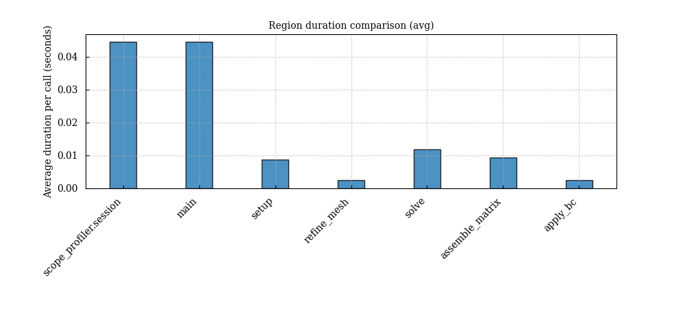
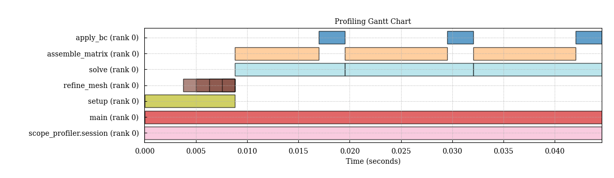
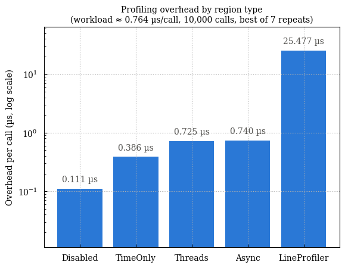

# scope-profiler

Profile Python code regions—and optionally C, Fortran, MPI, NVTX, and
[LIKWID](https://github.com/RRZE-HPC/likwid)—with one consistent API and HDF5
output format.

```bash
pip install scope-profiler
```

## Quick start

```python
from scope_profiler import ProfileManager

with ProfileManager.session():
    @ProfileManager.profile("main")
    def main():
        with ProfileManager.profile_region("work"):
            sum(range(100))  # replace with the code you want to measure

    main()
# writes profiling_data.h5 and prints a summary
```

You can also profile a script without changing its source:

```bash
scope-profiler run my_script.py
scope-profiler inspect profiling_data.h5
scope-profiler plot default profiling_data.h5 -o figures
```

The plotting tools include duration summaries and timelines for quickly
finding expensive regions:





Run the overhead benchmark to measure the cost of each instrumentation mode
on your machine:

```bash
python examples/benchmark_overhead.py
```



## Documentation

- [Installation](https://scope-profiler.readthedocs.io/en/latest/installation.html)
- [Quick start](https://scope-profiler.readthedocs.io/en/latest/quickstart.html)
- [Python API and post-processing](https://scope-profiler.readthedocs.io/en/latest/guide/hdf5_and_python_api.html)
- [CLI reference](https://scope-profiler.readthedocs.io/en/latest/cli.html)
- [Configuration and profiling regions](https://scope-profiler.readthedocs.io/en/latest/guide/configuration.html)
- [MPI](https://scope-profiler.readthedocs.io/en/latest/guide/mpi.html), [C](https://scope-profiler.readthedocs.io/en/latest/guide/c.html), and [Fortran](https://scope-profiler.readthedocs.io/en/latest/guide/fortran.html)
- [LIKWID](https://scope-profiler.readthedocs.io/en/latest/guide/likwid.html), [line profiling](https://scope-profiler.readthedocs.io/en/latest/guide/line_profiler.html), and [MCP](https://scope-profiler.readthedocs.io/en/latest/guide/mcp.html)
- [Tutorial notebooks](https://scope-profiler.readthedocs.io/en/latest/tutorials.html)
- [Examples](examples/)

## Development

```bash
pip install -e '.[dev]'
pytest
```

See [AGENTS.md](AGENTS.md) for the measured benchmark workflow used when
optimizing this project.
