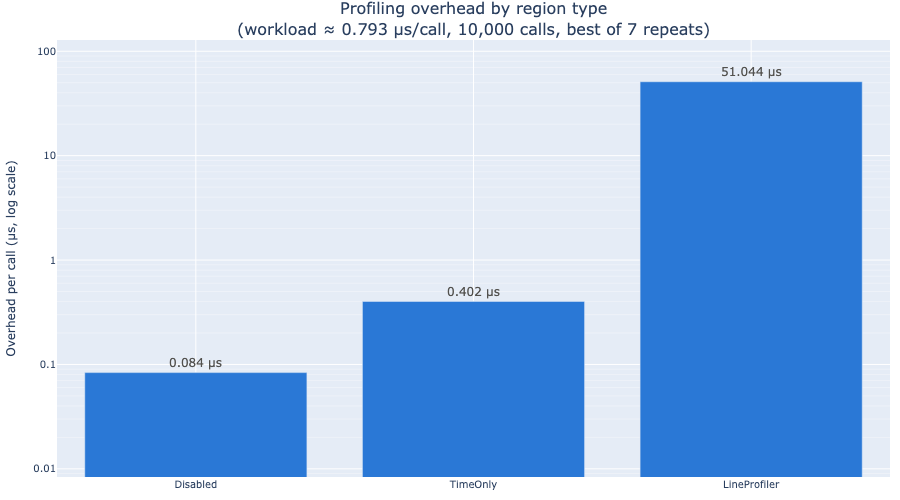

# Profiling overhead

> **Install for this page:** `pip install "scope-profiler[pproc]"`; the
> benchmark uses maxplotlib to save its result as a figure.

scope-profiler is designed for production HPC workloads where
instrumentation must not distort the measurements. This page documents
the per-call overhead of each profiling mode.

## Benchmark

The benchmark script (`examples/benchmark_overhead.py`) times a small
workload function through each profiling mode and subtracts the bare
function-call baseline to isolate the overhead.

```bash
python examples/benchmark_overhead.py          # save figure
python examples/benchmark_overhead.py --show   # display interactively
```



## Results summary

| Region type      | Overhead / call |
| ---------------- | --------------: |
| **Disabled**     |        ~0.1 µs  |
| **TimeOnly**     |       ~0.33 µs  |
| **LineProfiler** |        ~50 µs   |

_(Numbers measured on an Apple M-series CPU; absolute values will vary,
but the relative ordering is stable.)_

## What this means for HPC

The **TimeOnly** mode — the default and most commonly used — adds
roughly **0.33 µs** per instrumented call. In practice:

- A 64×64 matrix multiply takes ~36 µs, so the overhead is **< 2 %**.
- A 256×256 matrix multiply takes ~780 µs, giving **< 0.1 %** overhead.
- Typical simulation time steps run for milliseconds or longer, making
  the overhead unmeasurable.

The profiler can also be **fully deactivated** at startup
(`deactivate_profiling=True`) without removing any instrumentation from
the source code. In this mode the overhead drops to ~0.1 µs — barely
above the cost of a bare function call.

## LineProfiler

The `line_profiler` mode is intentionally heavier (~50 µs per call)
because it instruments every source line in the profiled function. It
is meant for **targeted debugging of individual functions**, not for
always-on use in hot loops.

## Regression guards

The numbers above are benchmarks. What keeps them from drifting is a separate
set of budgets in the test suite, run with the `overhead` marker:

```bash
pytest -m overhead                 # per-call, write, and read budgets
pytest -s -m overhead              # ...printing every measurement
pytest src/scope_profiler/tests/test_storage_size.py -s   # file size
```

| module | covers |
| --- | --- |
| `test_overhead.py` | per-call cost of each region type, region lookup, source capture, buffer growth, nesting depth |
| `test_overhead_io.py` | `finalize()` write cost, publication packing, read cost, summary-only reads, the timestamp codec |
| `test_storage_size.py` | bytes per event, the fixed floor, scaling in events/ranks/regions, compression ratios |

The budgets sit roughly an order of magnitude above what an idle laptop
measures, so a loaded CI machine still passes while a structural regression
--- an allocation or a lock on the hot path, a per-event Python loop in the
writer, a quadratic index rebuild --- does not. Each measurement takes the
minimum over several repeats, which is the robust estimator for a cost: noise
can only ever add time.

The **scaling** assertions matter more than the absolute ones, and are the
reason the suite catches things a benchmark would not. An absolute budget can
only catch a change large enough to blow it; a ratio between the same
measurement at two sizes catches a change in the *shape* of the cost. For
example, a summary-only read of a ten-times-larger profile must cost about the
same (measured: 1.0x), which is what proves it never touches the event
columns.

## Writing and reading a profile

The per-call numbers above are what instrumentation adds to the program. What
`finalize()` then spends turning the recorded buffers into a file is separate,
and matters for its own reasons: it happens at the end of a run that may have
been queued for hours, and under MPI it is collective, so a write that scales
badly stalls every rank.

Measured on an idle laptop, jittered synthetic data:

| | cost |
| --- | ---: |
| write, 100,000 events | ~93 ns/event |
| write, 10,000 events | ~510 ns/event |
| write with `hdf5_compression="auto"` | ~2x the plain write |
| publication packing, small profile | ~2.5 ms (fixed) |
| read, uncompressed | ~18 ns/event |
| read, gzip-compressed | ~66 ns/event |
| summary-only read | independent of event count |
| timestamp encode / decode | ~0.4 / ~2.1 ns/event |

`examples/benchmark_io.py` measures all of these, and `--scaling` sweeps the
rank count so the per-rank cost can be checked for flatness:

```bash
python examples/benchmark_io.py --scaling 8,32,128
python examples/benchmark_io.py --json          # to diff between revisions
```

A small profile is dominated by the fixed ~2.5 ms publication pass, which is
why the per-event figure is so much higher at 10,000 events than at 100,000.
That pass is what removes the per-dataset chunk overhead; see
[Output file size](configuration.qmd#output-file-size).

Reading through gzip costs about 3.5x an uncompressed read. That is the other
side of the ~5x space saving, and it is why compression is opt-in rather than
the default.

## Where the time goes

A recorded call is two `perf_counter_ns()` reads (~33 ns each from Python)
plus a slot reservation; the rest is the cost of the `with` statement or the
decorator wrapper itself. Those two together are about half the total and are
out of the library's hands: an empty `with` on a Python object already costs
~109 ns, and on a C-implemented one ~76 ns. Nothing touches the filesystem: the timestamps accumulate in a
numpy buffer that doubles when it fills, and the whole buffer is written once,
at `finalize()`. Writing is therefore not part of the per-call cost at all —
`deactivate_file_output` changes what happens at the end of the run, not what
happens in the loop.
