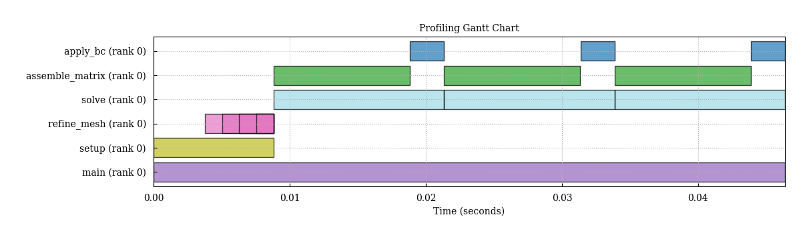

# Quickstart

> **Install for this page:** `pip install "scope-profiler[pproc]"`. The base
> install is sufficient through the text summary; `pproc` adds the plotted
> example in step 4.

This page walks through the lowest-touch workflow first: **mark regions**,
**run**, and **inspect**. It then shows the equivalent Python lifecycle API.

## 1. Run an instrumented script

Add regions where the application has meaningful phases; no in-source session
or setup call is required:

```python
import scope_profiler as sp

def main():
    with sp.region("iteration", tags=["solver"]):
        evolve()

main()
```

Run the script through the CLI:

```bash
scope-profiler run example.py -o profile.h5
```

The same script run with `python example.py` leaves the regions disabled and
writes no profile. To trace functions that were not explicitly marked, opt in
to recursive tracing:

```bash
scope-profiler run --recursive example.py
```

You can select tagged regions and filter recursive function names without
editing the script again:

```bash
scope-profiler run --tag solver --include 'my_app.*' example.py
```

For a named application entrypoint, use `--entrypoint main`.

## 2. Start a session

Use `ProfileManager.session()` as the default entry point. Configuration
arguments are passed directly to the session:

```python
from scope_profiler import ProfileManager

with ProfileManager.session():
    # Profile regions inside this block.
    run_application()
```

All regions created inside the session --- even in other modules --- share its
configuration.

For a callable entrypoint, `sp.run()` provides the same setup/finalize safety
without a context-manager block:

```python
import scope_profiler as sp

sp.run(run_application, output="profile.h5")
```

Use `sp.setup(auto_finalize=True)` when a long-running script needs one startup
call and cannot wrap its whole application in a `with` block.

## 3. Instrument your code

### Decorator

Use `@ProfileManager.profile` to wrap an entire function:

```python
@ProfileManager.profile("matrix_multiply")
def matrix_multiply(a, b):
    return a @ b
```

The decorator also works without an explicit name --- it uses the function
name by default:

```python
@ProfileManager.profile
def matrix_multiply(a, b):
    return a @ b
```

To include nested Python calls made by a decorated function:

```python
with ProfileManager.session(recursive_profile=True):
    @ProfileManager.profile("solver_step")
    def solver_step():
        return advance_state()  # nested calls are recorded automatically
```

### Context manager

Use `ProfileManager.region()` for finer-grained control:

```python
for step in range(num_steps):
    with ProfileManager.region("time_step"):
        evolve(state, dt)

    with ProfileManager.region("io"):
        write_checkpoint(state)
```

The two styles can be mixed freely.

## 4. Finish the session

When the `with` block exits, the session writes all buffered data, merges
per-rank HDF5 files, and prints a summary. Use `return_results=True` to keep
the finalized results in memory:

```python
with ProfileManager.session(return_results=True) as run:
    run_application()

results = run.results
```

Output:

```{eval-rst}
.. literalinclude:: _generated/quickstart-overview.txt
   :language: text
```

The same table is available from `ProfilingResults.print_summary()` and from
`scope-profiler inspect`; pass `verbose=False` to `finalize()` to suppress it.

## 5. Inspect the data

After finalization the timing data is saved to `profiling_data.h5` (default).
Use the built-in CLI to generate a Gantt chart:

```bash
scope-profiler plot default profiling_data.h5 --show
```



See {doc}`/guide/plot_cli` for the other charts and exports it can
produce. Or load the data programmatically:

```python
from scope_profiler import load

results = load("profiling_data.h5")

# The quickest look: a summary table of every region.
results.print_summary()

# Or region by region (durations are in seconds).
for region in results:
    print(f"{region.name}: {region.num_calls} calls, "
          f"avg {region.average_duration:.4f} s")
```

`load()` reads whichever format the file is in --- HDF5 or JSON --- so a path
is all you need. `read_h5()` and `read_json()` remain available when the
format is already known.

## Complete example

```python
from scope_profiler import ProfileManager

with ProfileManager.session():
    @ProfileManager.profile("main")
    def main():
        x = 0
        for i in range(10):
            with ProfileManager.region("iteration"):
                x += 1

    main()
```

```bash
python example.py
```

```{eval-rst}
.. literalinclude:: _generated/quickstart-complete.txt
   :language: text
```
